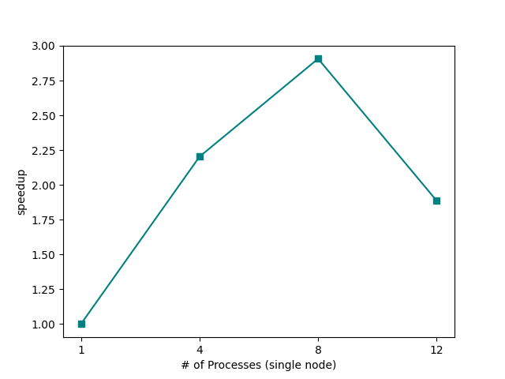
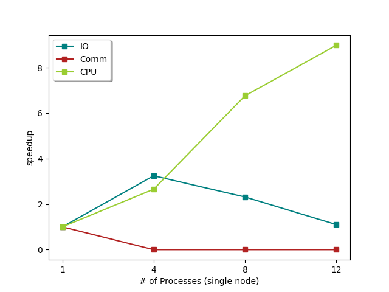
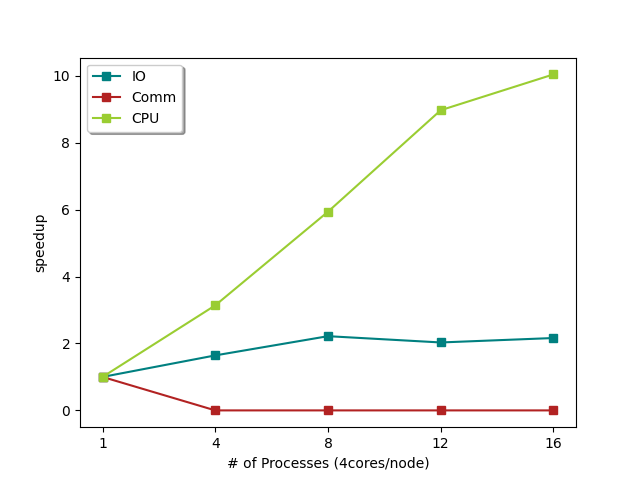
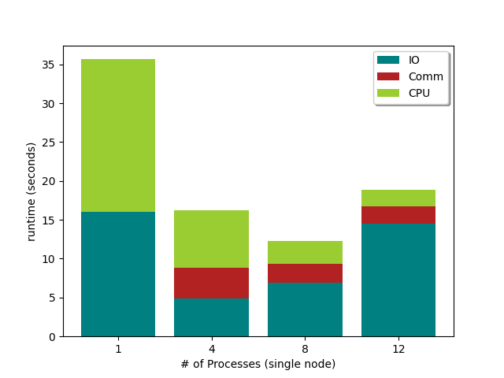
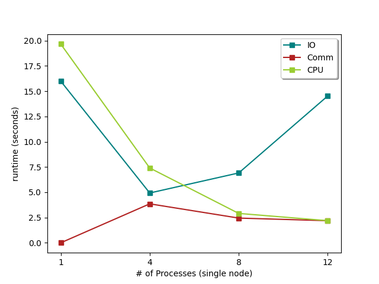
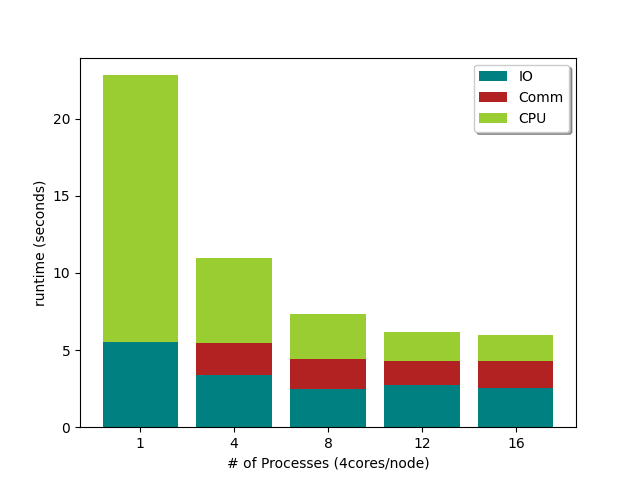
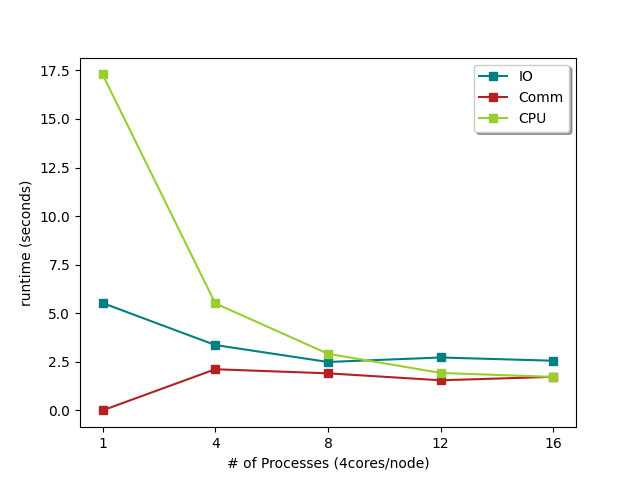

# Odd-Even Sort
> Implementing parallel odd-even sort algorithm using MPI.

## Speedup
### single node

| | |
|  ----  | ----  |
| | |

### multi-node

| | |
|  ----  | ----  |
| | |

## Time Profile
### single node

| | |
|  ----  | ----  |
| | |

### multi-node

| | |
|  ----  | ----  |
| | |