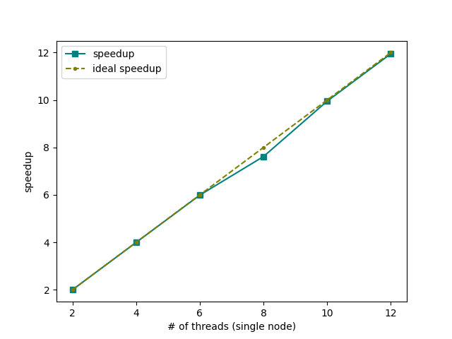
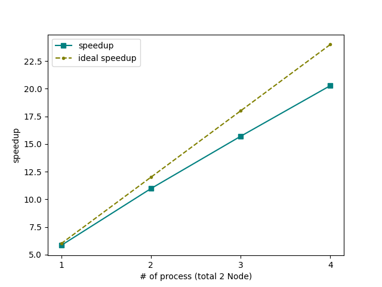
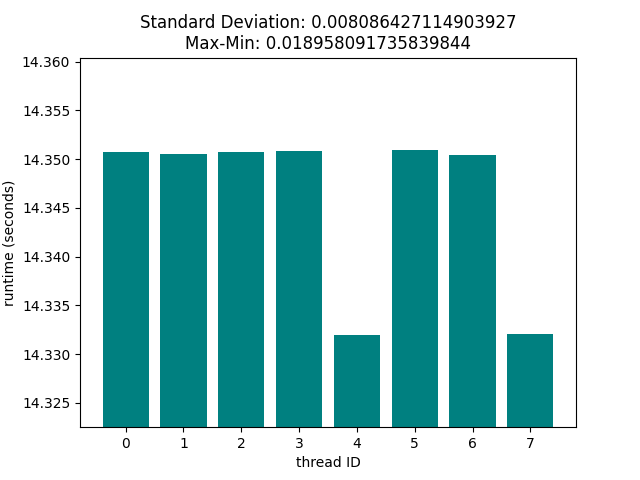
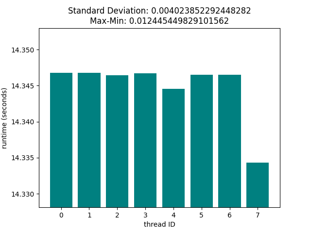
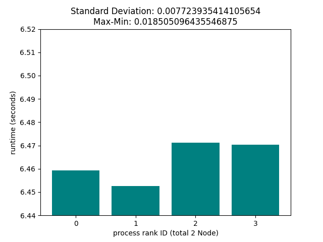
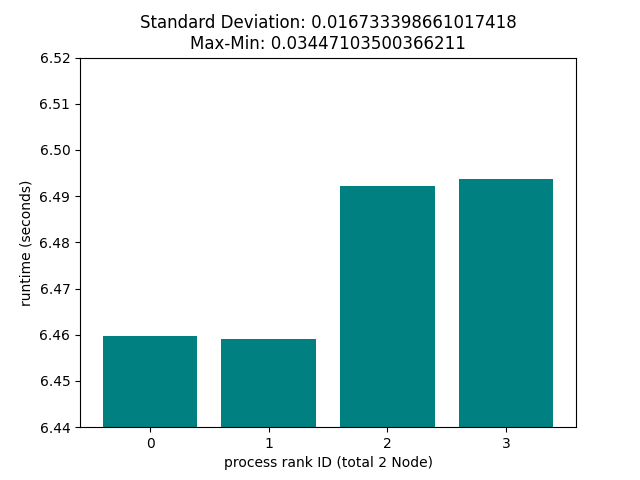

# Mandelbrot Set

> Thread programming using Pthread and OpenMP

> Hybrid method by combining process and thread

## Speedup

### Pthread

### MPI + OpenMP

## Load balance

### Pthread

 

### MPI + OpenMP

 