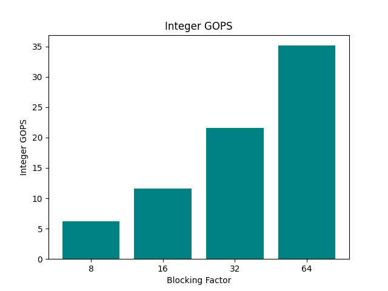
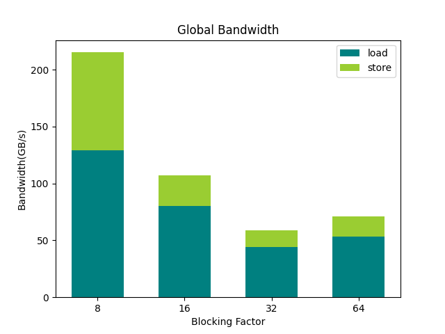
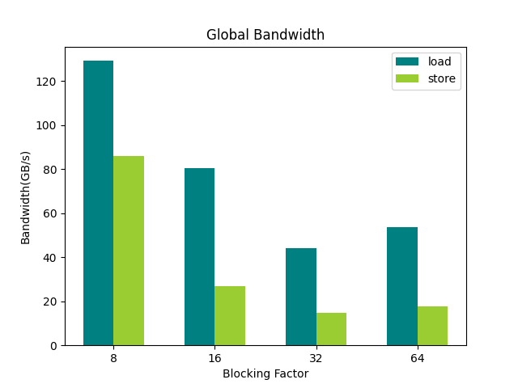
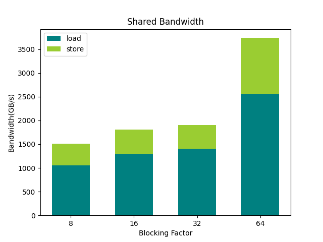
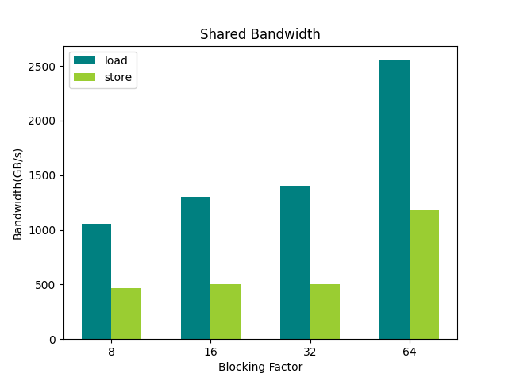
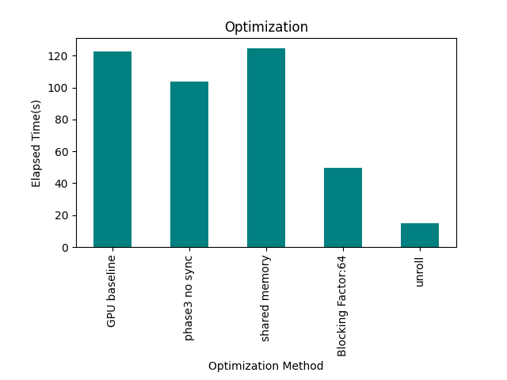
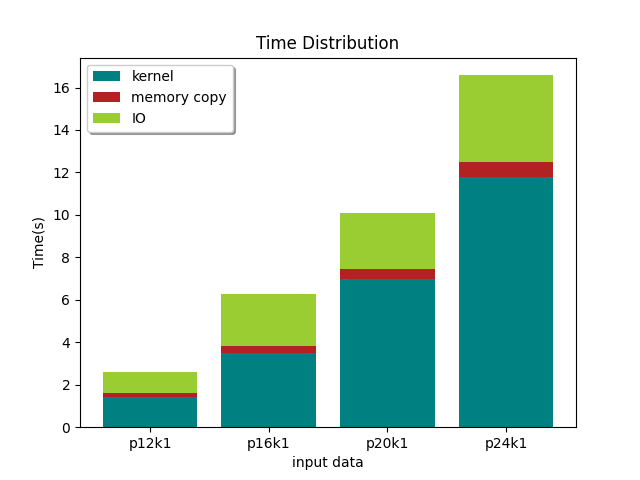

# All-Pairs Shortest Path

> Implementing Blocked Floyd-Warshall algorithm with CUDA

> Exploring different optimizing strategies

## Integer GOPS

## global memory bandwidth

 

## shared memory bandwidth

 

## Optimization

## Time Distribution

